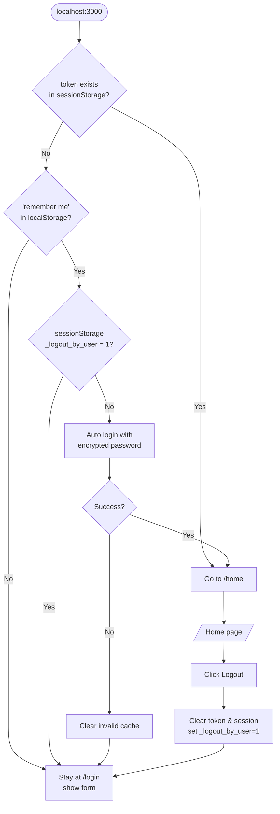

# Vue3 + Vite + Pinia – Login Flow Example

A minimal yet **production-ready** login template that implements:

- Login (password SHA-256 encrypted)  
- “Remember me” (7 days)  
- Auto-restore session after page refresh / browser re-open  
- Logout (clears session but keeps “remember me”)  
- Global axios wrapper with 401 handler & error fallback  
- Infinite-redirect guard (distinguishes manual logout vs first visit)  

No UI framework, no boilerplate fat—clone, install and run.

---

## Structure
```code
\--src
    ├─ main.js
    ├─ router/index.js       # Router Guardd + infinite-redirect fix
    ├─ stores/auth.js  # Pinia store
    ├─ api/user.js     # login api
    ├─ utils/request.js # axios instance
    ├─ views
    │  ├─ Login.vue
    │  └─ Home.vue
    ├─ main.js
    └─ App.vue
 └─ vite.config.js
```

## Flow



## Quick Start
```bash
# 1. install
npm i

# 2. start frontend
npm run dev        # http://localhost:3000

# 3. start backend (zero-deps mock server)
node backend/server.js   # http://localhost:8080
```

---

## Backend
We provide a **zero-dependency** mock server for rapid testing. 
```bash
npm i
npm run dev
```

## License
MIT © 2026 xuqb1

